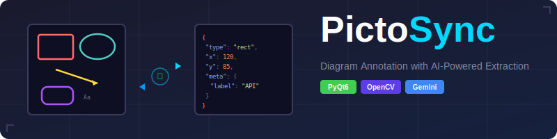

<p align="center">
  
</p>

# PictoSync

**v1.7** | PNG Image Canvas Tool for Object Synchronization

Diagram annotation tool with AI-powered extraction and bidirectional sync.

## Abstract

PictoSync is a PyQt6 desktop application for creating and managing diagram annotations. It combines manual drawing tools with Google Gemini AI (see note below) to automatically extract structural elements from architecture diagrams (such as C4 models). The application maintains bidirectional synchronization between a visual canvas and JSON representation, enabling a human-in-the-loop workflow where AI extracts, humans refine, and changes sync back seamlessly.

**Note**: If you don't have a Google Gemini API key, or dont want to send your picture to Google for scanning, you can still place a graphic on the picture and then use the local optimizer to match the grahpics to the PNG.

## Features
**For a comparison to other tools and their features see this file:  [Round Tripping PNG Tools](png_json_comparison.md)**

### Drawing & Annotation
- **Manual Drawing Tools**: Rectangle, rounded rectangle, ellipse, hexagon, cylinder, block arrow, isometric cube, polygon, curve, orthogonal curve, line, and text annotations
- **Isometric Cube**: Container shape with configurable extrusion depth and angle (0–360°); drag control handles to adjust depth and direction interactively
- **Curve Tool**: Click-click placement of SVG path-like curves with node editing; supports cubic bezier (`C`), quadratic bezier (`Q`), arc (`A`), and line (`L`) segments; right-click nodes to change type; arrowhead support (none, start, end, both)
- **Orthogonal Curve**: Curve variant restricted to horizontal/vertical segments (M/H/V nodes) with optional corner bend radius; Ctrl+click to extend; arrowhead support
- **Polygon Tool**: Multi-click vertex placement with right-click to close; double-click to enter vertex editing mode with draggable control knobs; right-click vertices to delete, right-click edges to add vertices
- **Text Labels**: All shapes support label, tech, and note text with customizable formatting
- **Text Alignment**: Vertical alignment (top/middle/bottom) and line spacing controls
- **Pen Styles**: Solid or dashed lines with configurable dash pattern (length, solid percent)
- **Z-Order Control**: Right-click context menu to "Bring to Front" or "Send to Back"
- **Auto-Stacking**: New shapes automatically appear on top of existing items

### Groups
- **Group/Ungroup**: Select multiple items and group them; ungroup to restore individual items
- **Group Resize**: 8 handles (4 corners + 4 sides) with proportional scaling of all children
- **Nested Hierarchy**: PlantUML cluster/entity parent-child relationships parsed into group annotations with recursive children

### Undo/Redo
- **Move**: Single and multi-select item movement
- **Resize**: All shape types including proportional group resize
- **Text Editing**: Full text edit history
- **Properties**: All property panel changes (colors, metadata, line styles, adjustments)

### Element Alignment (OpenCV)
- **Shape Alignment**: Snap rectangles, rounded rectangles, and ellipses to match PNG visuals
- **Line Detection**: Detect and align line elements including endpoints, angle, and length
- **Arrowhead Detection**: Automatically detects triangular arrowheads and extends line endpoints
- **Dashed Line Support**: Merges collinear segments to handle dashed/dotted lines
- **Text Matching**: Uses label/note text to locate lines in the image
- **Color Matching**: HSV-based color detection matches pen colors in the PNG

### PlantUML Import
- **PlantUML Rendering**: Import `.puml` files directly via drag-and-drop or File > Open
- **SVG Position Extraction**: Parses PlantUML-rendered SVG for pixel-accurate element positioning
- **Curve Connector Parsing**: SVG `<path>` elements with cubic bezier curves are parsed into curve annotations preserving actual connector geometry (instead of simple center-to-center lines)
- **Dedicated Description Diagram Parser**: Component, deployment, use-case, and architecture diagrams parsed directly from SVG structure (entities, clusters, links) for reliable extraction
- **Bracket Notation Support**: Captures `[Component Name] as alias` syntax that text-regex extraction would miss
- **Cluster/Package Support**: PlantUML packages render as polygon shapes with SVG path vertices; rect-vs-path detection correctly handles decorative tab overlays
- **Activity Diagram Support**: Parses activity diagram SVGs with partitions, activities, flow lines, and start/end nodes
- **Link Style Extraction**: Stroke colors and dash patterns from SVG applied to connectors
- **Diagram Name Validation**: Warns about Windows-illegal characters in `@startuml` names that would cause silent rendering failures

### Mermaid SVG Import
- **Pre-Rendered SVG**: Import Mermaid SVG files (from Mermaid Live Editor, VS Code, or mermaid.ink) via drag-and-drop or File > Open
- **SVG-to-PNG Rendering**: Qt-based SVG renderer converts Mermaid SVGs to temporary PNG for canvas background; `<foreignObject>` text replaced with native SVG `<text>` for Qt compatibility
- **Flowchart Parser**: Parses nodes (rect, roundedrect, polygon/diamond), edge paths (curves and lines), edge labels, and cluster subgraphs from Mermaid flowchart SVGs
- **Mermaid Detection**: Automatic identification via `aria-roledescription` attribute on the root `<svg>` element

> **C4 diagram layout note**: The Mermaid CLI (`mmdc`) has a [known bug](https://github.com/mermaid-js/mermaid-cli/issues/440) where `UpdateLayoutConfig` / `c4ShapeInRow` is ignored in headless Puppeteer mode, causing C4 diagrams to render in a single column. PictoSync works around this by running mmdc in headed (non-headless) mode for C4 diagrams, which briefly opens a browser window during rendering. This is a Mermaid CLI issue, not a PictoSync bug.

### PowerPoint Export
- **Slide Export**: Export annotations as native PowerPoint shapes via File > Export PPTX
- **Shape Support**: Rectangles, rounded rectangles, ellipses, hexagons, cylinders, block arrows, isometric cubes, polygons, curves, orthogonal curves, lines, and text
- **Native Bezier Curves**: Curves export as OOXML `a:cubicBezTo` and `a:quadBezTo` elements preserving control points
- **Isometric Cube**: Exported as PowerPoint CUBE auto-shape with depth adjustment and flipH/flipV for angle mapping
- **Orthogonal Curve**: Exported as freeform polyline from M/H/V nodes with arrowhead support
- **Curve Labels**: Label/tech/note text placed at the parametric midpoint (t=0.5) of the actual curve path
- **Arrowheads**: Line, curve, and orthogonal curve arrowheads exported via `tailEnd`/`headEnd` attributes
- **Semi-Transparent Fills**: Fill colors with alpha transparency export with PPTX transparency (not discarded)
- **Fill & Text Colors**: Fill colors, border colors, text colors, font sizes, and alignment
- **Polygon Freeforms**: Polygon shapes exported as PowerPoint freeform shapes
- **Group Flattening**: Groups recursively flattened for export
- **Export Directory Setting**: Option to default PPTX export to the source file's directory

### AI Integration
- **AI Extraction**: Automatic diagram element detection using Google Gemini models
- **Model Selection**: Configurable model list and default model in settings; dropdown menu in toolbar to switch models
- **Focus Align**: Refine a selected element via Gemini AI on a cropped region around it
- **Token Counter**: Live Gemini token usage counter displayed on the toolbar
- **Smart Defaults**: Extracted elements automatically get formatting defaults
- **Markdown Handling**: Automatically strips markdown fences from AI responses

### Synchronization
- **Bidirectional Sync**: Real-time synchronization between canvas elements and JSON editor
- **Live Drag Updates**: Geometry values update in the JSON editor in real-time during drag without scroll jumping
- **Scroll Lock During Interaction**: Editor scroll position is frozen from mouse-down to mouse-up, then scrolls to the final position on release
- **Human-in-the-Loop**: AI extracts → Human edits → Syncs back (round-trip workflow)
- **Project Save/Load**: Save and load projects (annotations + PNG) to a configurable workspace directory

### JSON Editor
- **Syntax Highlighting**: Full JSON syntax highlighting
- **Line Numbers**: Theme-aware line number gutter with selection highlighting
- **Code Folding**: Collapse/expand JSON objects and arrays
- **Focus Mode**: Toggle to show only the selected annotation (lamp icon)
- **Schema Check**: Toggle checkbox compares the focused annotation against `annotation_schema.json` — missing fields appear as gray ghost text, extra fields are highlighted in red; value-only validation (pattern, range, enum, type) blocks rebuilds while structural differences (extra/missing fields) are allowed; overlays refresh automatically after scene rebuilds
- **Accept Ghost Fields**: Right-click a gray ghost field to "Accept" it — the field becomes permanent and survives toggling schema check off
- **Schema-Driven Defaults**: All default annotation values (meta, style, per-kind overrides) are derived from the JSON schema — no hardcoded Python dicts
- **Smart Scrolling**: Clicking canvas items scrolls editor to the annotation's opening brace on mouse release
- **Gutter Highlight Bar**: Colored bar in gutter marks the full scope of the selected annotation
- **Consistent Precision**: Geometry values use 2 decimal places, style values use 1 decimal place

### Property Panel
- **Context-Sensitive**: Shows relevant controls based on selected item type
- **Schema-Driven Adjust Controls**: Adjust spinboxes (radius, indent, cap, shaft, head) derive labels, suffixes, and ranges from `annotation_schema.json`
- **Qt Designer UI**: Built with Qt Designer for consistent layout
- **Auto-Compile**: UI files are automatically compiled on startup if modified
- **Text Formatting**: Font size, alignment, vertical position, and spacing controls

### User Interface
- **Dynamic Title Bar**: Window title shows the currently loaded file (e.g. "PictoSync — diagram.puml"); reverts to default when no file is loaded
- **Wait Cursor During Imports**: Busy cursor provides visual feedback while PlantUML/Mermaid CLI tools render
- **Wider JSON Editor**: JSON editor dock starts at 500px width for less text wrapping
- **Compact Settings Dialog**: Tighter tab labels, reduced margins, and smaller dialog footprint
- **Hide/Show PNG**: Toggle background image visibility for cleaner annotation view
- **Handle-Enclosed Selection**: Rubber band selection respects individual item handles with live preview
- **Multiple Themes**: 7 built-in themes (Foundation Dark, Bulma Light, Bauhaus, Neumorphism, Materialize, Tailwind, Bootstrap)
- **Styled Splitters**: High-contrast, theme-aware resize handles
- **Custom Icons**: Theme-matched SVG icons for all tools and actions

## Installation

```bash
# Clone the repository
git clone https://github.com/pjm4github/pictosync.git
cd pictosync

# Install dependencies
pip install -r requirements.txt
```

## Requirements

- Python 3.8+
- PyQt6
- Pillow
- google-genai
- opencv-python (for element alignment)
- python-pptx (for PowerPoint export)
- pytest (for running tests)

Set your Google API key for AI extraction:
```bash
export GOOGLE_API_KEY=your_api_key_here
```

## Usage

```bash
python main.py
```

## Testing

PictoSync includes an automated test suite under `tests/` using pytest. Tests require a GUI environment (not headless).

```bash
# Run all tests
python -m pytest tests/ -v

# Run a specific test file
python -m pytest tests/test_scroll_preservation.py -v
```

### Test Coverage

| Test Module | What It Covers |
|-------------|---------------|
| `test_item_kinds.py` | All 12 item kinds end-to-end: creation/JSON field correctness, property panel meta editing (label, tech, note), pen color changes, and no duplicate IDs |
| `test_adjust_roundtrip.py` | Schema-driven adjust control labels, suffixes, ranges; adjust value round-trips through panel/JSON/canvas; no duplicate IDs after adjust changes |
| `test_scroll_preservation.py` | Editor scroll stays frozen during canvas drag; JSON geometry values update live during drag; PUML import produces correct annotations with full meta fields; re-import works after drag |
| `test_ungroup_drag.py` | Ungroup preserves index integrity; no duplicate IDs after ungroup; children retain `on_change` callbacks; geometry updates during drag after ungroup; move-then-ungroup-then-drag scenario |
| `test_flow_ungroup.py` | Move-then-ungroup-then-drag on flow/activity diagrams; index integrity and duplicate ID checks; child callback and geometry verification |

### Basic Workflow
1. **Load an image**: Drag and drop a PNG/PUML file or use File > Open
2. **Draw annotations**: Select a tool (R=Rect, U=RoundedRect, E=Ellipse, L=Line, V=Curve, T=Text, H=Hexagon, Y=Cylinder, A=Block Arrow, I=Iso Cube, P=Polygon, S=Select)
3. **AI extraction**: Click "Auto-Extract (Gemini)" to detect diagram elements
4. **Edit JSON**: Modify annotations in the Draft JSON panel
5. **Link**: Click "Import & Link" to enable bidirectional JSON ↔ Canvas sync
6. **Save**: Save your project via File > Save Project (Ctrl+S)
7. **Export**: Export to PowerPoint via File > Export PPTX

### Keyboard Shortcuts
| Key | Action |
|-----|--------|
| S | Select mode |
| R | Rectangle tool |
| U | Rounded rectangle tool |
| E | Ellipse tool |
| L | Line tool |
| V | Curve tool |
| T | Text tool |
| H | Hexagon tool |
| Y | Cylinder tool |
| A | Block arrow tool |
| I | Iso Cube tool |
| P | Polygon tool |
| Ctrl+Z | Undo |
| Ctrl+Y | Redo |
| Ctrl+S | Save project |
| Ctrl+O | Open project |
| Delete | Delete selected item |

### Tips
- **Z-Order**: Right-click a selected shape for "Bring to Front" / "Send to Back"
- **Iso Cube**: Drag the depth handle to change extrusion depth; drag the angle handle to rotate the extrusion direction
- **Curve Editing**: Double-click a curve to enter node editing mode; right-click a node to change its type (Line, Cubic, Quadratic, Arc)
- **Orthogonal Curve**: Select "Ortho" from the curve dropdown; Ctrl+click to extend with new H/V segments
- **Focus Mode**: Click the lamp icon to collapse all annotations except the selected one
- **Schema Check**: Enable the Schema checkbox to see missing/extra fields; right-click gray ghost fields to accept them
- **Hide PNG**: Toggle background visibility when annotations obscure the image
- **Themes**: Access Settings to switch between 7 visual themes
- **Text Formatting**: Use the property panel to adjust vertical alignment and spacing
- **Element Alignment**: Select a shape or line and use "Align to PNG" to snap it to the visual
- **Group Resize**: Select a group and drag corner/side handles to proportionally resize all children

## Project Structure

```
pictosync/
├── main.py              # Application entry point, MainWindow
├── models.py            # Data models, AnnotationMeta, DrawMode, normalize_meta()
├── styles.py            # Theme stylesheets, dash patterns, color configs
├── utils.py             # JSON parsing, coordinate scaling, markdown handling
├── settings.py          # Application settings (workspace, export, Gemini models)
├── settings_dialog.py   # Settings dialog UI (general, themes, Gemini model list)
├── undo_commands.py     # Undo/redo commands for all canvas operations
├── canvas/              # Graphics layer
│   ├── items.py         # Annotation items (Rect, Ellipse, Hexagon, Cylinder, BlockArrow, IsoCube, Polygon, Curve, OrthoCurve, Line, Text, Group)
│   ├── mixins.py        # LinkedMixin, MetaMixin for shared behavior
│   ├── scene.py         # AnnotatorScene (drawing, context menu, z-order)
│   └── view.py          # AnnotatorView (zoom, pan, drag-drop, rubber band selection)
├── editor/              # JSON editor
│   ├── code_editor.py   # JsonCodeEditor with folding, focus mode, and ghost field context menu
│   ├── draft_dock.py    # DraftDock widget with scroll-to-id, scroll lock, and schema check overlays
│   ├── schema_checker.py # Schema diff engine: expected template, field diff, char-range finder
│   └── highlighter.py   # JSON syntax highlighting
├── properties/          # Property panel
│   ├── dock.py          # PropertyPanel controller (schema-driven adjust controls)
│   ├── properties_panel.ui   # Qt Designer UI file
│   └── properties_ui.py      # Auto-generated from .ui file
├── schemas/             # JSON schemas and schema utilities
│   ├── __init__.py      # Schema-driven defaults, value-only validation, template builder
│   └── annotation_schema.json  # Annotation format specification (including curve, group)
├── plantuml/            # PlantUML import
│   ├── renderer.py      # PlantUML to PNG/SVG rendering
│   └── parser.py        # PUML text parsing, SVG position/path extraction, description diagram parser
├── mermaid/             # Mermaid SVG import
│   ├── parser.py        # Mermaid SVG detection and flowchart parsing
│   └── renderer.py      # SVG-to-PNG rendering with foreignObject preprocessing
├── gemini/              # AI integration
│   └── worker.py        # Threaded Gemini API worker
├── pptx_export.py       # PowerPoint slide export (all 12 kinds, native bezier curves, arrowheads, labels)
├── alignment/           # OpenCV alignment
│   ├── optimizer.py     # Shape and line alignment algorithms
│   └── worker.py        # Threaded alignment workers
├── icons/               # Theme-aware SVG icons
│   ├── generate_icons.py    # Icon generation script
│   └── [Theme folders]      # Icons for each theme
├── tests/               # Automated test suite (pytest)
│   ├── test_item_kinds.py           # All 12 item kinds end-to-end
│   ├── test_adjust_roundtrip.py     # Adjust control schema validation
│   ├── test_scroll_preservation.py  # Scroll lock & live update tests
│   ├── test_ungroup_drag.py         # Ungroup + drag correctness
│   └── test_flow_ungroup.py         # Flow diagram ungroup + drag
├── test_data/           # Test fixture data
│   ├── PUML/            # Anonymized PlantUML test diagrams
│   └── MERMAID/         # Mermaid SVG test files (all 18 diagram types)
└── requirements.txt
```

## Schema

Annotations follow a JSON schema with support for:
- **Geometry**: rect, roundedrect, ellipse, hexagon, cylinder, blockarrow, isocube, polygon, curve, orthocurve, line, text, group
- **Curve Geometry**: Bounding box (`x, y, w, h`) plus `nodes` array with SVG path commands (`M`, `L`, `C`, `Q`, `A`, `Z`) and normalized 0–1 control point coordinates
- **Group**: Recursive `children` array containing nested annotations
- **Meta**: label, tech, note with alignment and sizing; `ui_label` and `ui_suffix` for schema-driven property controls; all text content lives in `meta.note` (no legacy top-level `text` field)
- **Style**: pen (color, width, dash, dash_pattern_length, dash_solid_percent), fill (color with alpha), text (color, size), arrow (none, start, end, both)
- **Text Layout**: vertical alignment, spacing, bounding box dimensions

See `schemas/annotation_schema.json` for the full specification.

## Diagram Import Coverage

### PlantUML

| Diagram Type | Parse | Render | Test Data | Notes |
|-------------|:-----:|:------:|:---------:|-------|
| Component | Y | Y | `test_component.puml` | Description diagram parser (entities, clusters, links) |
| Deployment | Y | Y | `test_descript.puml` | Description diagram parser |
| Use Case | Y | Y | `test_use_case.puml` | Description diagram parser |
| Architecture | Y | Y | `test_arch1.puml` | Description diagram parser |
| Activity | Y | Y | `test_flow.puml` | Dedicated parser (partitions, flow lines, start/end nodes) |
| Sequence | Y | Y | `test_seq1.puml` | Dedicated parser (participants, messages, lifelines) |
| State | Y | Y | `Recloser_State_Machine.puml` | Dedicated parser (states, transitions, start/end) |
| Class | Y | Y | — | Falls through to generic SVG position extraction |

### Mermaid SVG

| Diagram Type | `aria-roledescription` | Parse | Render | Test Data | SVG Structure |
|-------------|----------------------|:-----:|:------:|:---------:|---------------|
| **Flow & Logic** | | | | | |
| Flowchart | `flowchart-v2` | Y | Y | `flowchart1.svg` | `nodes`/`edgePaths`/`edgeLabels` groups |
| State Diagram | `stateDiagram` | — | — | `state1.svg` | Same groups; `state-*` IDs; circle + path shapes |
| Block Diagram | `block` | — | — | `block1.svg` | Flat `<g class="block">` — nodes + edges as siblings |
| Packet Diagram | `packet` | — | — | `packet1.svg` | Grid of `<rect class="packetBlock">` + `<text>` labels |
| Kanban | `kanban` | — | — | `kanban1.svg` | `sections` clusters + `items` cards; no edges |
| Architecture | `architecture` | — | — | `architecture1.svg` | `architecture-services`/`-edges`/`-groups`; native `<text>` |
| **Sequence & Interaction** | | | | | |
| Sequence | `sequence` | — | — | `sequence1.svg` | Actor boxes, lifelines, message arrows, notes, loops |
| ZenUML | `zenuml` | — | — | `zenuml1.svg` | HTML/CSS-styled elements; no viewBox |
| User Journey | `journey` | — | — | `journey1.svg` | Sections, tasks, face icons, legends |
| **Data & Visualization** | | | | | |
| Pie Chart | `pie` | — | — | `pie1.svg` | `pieCircle` slices + legend |
| XY Chart | `xychart` | — | — | `xychart1.svg` | Axes, bar plots, line plots |
| Gantt | `gantt` | — | — | `gantt1.svg` | Section bands, task bars, tick marks |
| Timeline | `timeline` | — | — | `timeline1.svg` | Event/line/task wrappers, section nodes |
| Sankey | `sankey` | — | — | `sankey1.svg` | `nodes`/`links` groups |
| Quadrant Chart | `quadrantChart` | — | — | `quadrant1.svg` | 4 quadrant rects, data points, labels |
| **Relationships** | | | | | |
| Class Diagram | `class` | — | — | `class1.svg` | `nodes`/`edgePaths`/`edgeLabels`; member/method groups |
| ER Diagram | `er` | — | — | `er1.svg` | `nodes`/`edgePaths`; cardinality markers; attribute rows |
| Requirement | `requirement` | — | — | `requirement1.svg` | `nodes`/`edgePaths`; dashed relationship lines |
| **Other** | | | | | |
| C4 Context | `c4` | — | — | `c4context1.svg` | Person icons, system boxes, relationships |
| Git Graph | `gitGraph` | — | — | `gitgraph1.svg` | Commit bullets, branch arrows, labels |
| Mindmap | `mindmap` | — | — | `mindmap1.svg` | `nodes`/`edgePaths`; section-indexed branches |

**Y** = implemented, **—** = test data collected, parser not yet implemented

## Version History

### v1.7 (2026-02-27)
- Dynamic title bar shows currently loaded file name after import (PlantUML, Mermaid SVG, Mermaid source, or standalone PNG)
- Wait cursor during all import operations (PlantUML rendering, Mermaid CLI, SVG parsing) for visual feedback
- Wider JSON editor dock (500px initial width) reduces text wrapping
- Compact settings dialog: smaller footprint, tighter tab labels, reduced group box margins

### v1.6 (2026-02-22)
- Gemini model selection: configurable model list and default in settings, dropdown menu in toolbar
- Focus Align tool: refine a selected element via Gemini AI on a cropped region
- Gemini token counter displayed on the toolbar
- Schema-driven defaults: all annotation defaults derived from `annotation_schema.json` (no hardcoded Python dicts)
- Removed legacy top-level `text` field — all text content canonicalized to `meta.note`
- Value-only schema validation: pattern/range/enum/type checks block rebuilds; structural differences are allowed
- Accept Ghost Fields: right-click gray ghost fields to make them permanent
- Schema overlays refresh automatically after scene rebuilds
- Pen dash properties (`dash`, `dash_pattern_length`, `dash_solid_percent`) always serialized in records and Gemini prompts
- Standardized `style.fill` across schema, prompts, canvas, and export
- Compact toolbar padding/spacing with disabled button styles across all themes
- Fix shutdown crash when scene C++ object is deleted before selection signal
- Fix fill color picker to show opaque initial color when current fill is fully transparent
- Isometric Cube drawing tool: configurable depth and extrusion angle with interactive control handles
- Orthogonal Curve tool: H/V-only curve variant with corner bend radius and Ctrl+click extend
- PowerPoint export for isometric cube (CUBE auto-shape with flip mapping) and orthogonal curve (freeform polyline)
- Semi-transparent fill colors now export with PPTX transparency instead of being discarded
- Comprehensive item-kind test suite (`test_item_kinds.py`): 207 tests covering all 12 kinds end-to-end

### v1.5 (2026-02-18)
- Curve drawing tool with SVG path-like node editing (cubic bezier, quadratic bezier, arc, line segments)
- PlantUML SVG path parsing preserves actual connector geometry as curve annotations
- Dedicated description diagram parser for component, deployment, use-case, and architecture diagrams
- Native OOXML bezier export to PowerPoint (`a:cubicBezTo`, `a:quadBezTo`) with arrowheads and midpoint labels
- PPTX export-to-source-dir setting
- Cluster rect-vs-path parsing fix for decorative tab overlays
- Diagram name validation warns about illegal characters in `@startuml` names
- Comprehensive undo/redo for move, resize, text editing, and property changes
- Group resize with proportional child scaling via 8 handles
- Group kind support in schema, validation, export, and utilities
- Handle-enclosed rubber band selection with live preview
- Schema-driven adjust controls (labels, suffixes, ranges from `annotation_schema.json`)
- Fixed duplicate annotations when ungrouping a moved group
- Expanded test suite: `test_adjust_roundtrip.py`, `test_ungroup_drag.py`, `test_flow_ungroup.py`
- Renamed test data directory to `test_data/` with anonymized PUML fixtures

### v1.4 (2026-02-16)
- Standardized numeric precision: geometry values at 2 decimal places, style values at 1 decimal place
- Editor scroll position frozen during canvas drag/resize (mouse-down to mouse-up)
- Live JSON geometry updates during drag without scroll jumping
- Selection scroll deferred to mouse release for smooth click-and-drag
- Added automated test suite (`tests/`) with pytest
- Added pytest to requirements

### v1.3 (2026-02-15)
- Activity diagram SVG parser with partition groups, flow lines, ellipses, and polygons
- Nested group hierarchy from PlantUML cluster/entity parent-child relationships
- PowerPoint export: fill colors, border colors, text colors, font sizes, and alignment
- PowerPoint export: polygon freeform shapes, line labels, vertical text alignment
- Fixed PPTX color format handling (`#RRGGBBAA` instead of `#AARRGGBB`)
- Fixed PPTX text styling to reliably override PowerPoint theme defaults
- Fixed PPTX vertical alignment using `vertical_anchor` (python-pptx 1.0.2 API)
- Fixed crash when clearing grouped items from canvas

### v1.2 (2026-02-12)
- Polygon shape tool with multi-click vertex drawing and vertex editing mode
- SVG-based position extraction for PlantUML import (pixel-accurate placement)
- PlantUML packages/clusters render as polygons with SVG path vertices
- Link style extraction (stroke colors, dash patterns) from PlantUML SVG
- Fixed editor scroll-to-selection for documents with wrapped lines
- Gutter highlight bar shows full annotation scope on selection

### v1.1 (2026-01-29)
- OpenCV-based element alignment for snapping shapes to PNG visuals
- Line detection with endpoint, angle, and arrowhead detection
- Dashed line support via collinear segment merging
- Text matching to locate lines using label/note metadata

### v1.0 (2026-01-28)
- Initial stable release
- Text vertical alignment and spacing controls
- Ellipse text label support
- Dash pattern controls for pen styles
- Qt Designer property panel with auto-compile
- Focus mode scroll improvements
- AI extraction with formatting defaults
- 7 built-in themes

## License

MIT
