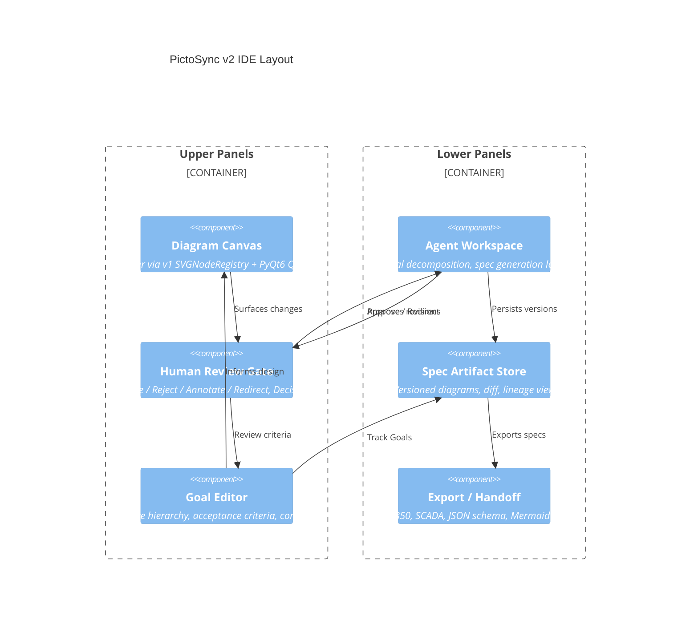

<p align="center">
  
</p>

# PictoSync

**v2.5** | Diagram Normalization & Agentic Specification IDE

---

## Why PictoSync Exists

Enterprise architecture artifacts live in dozens of formats: PlantUML component diagrams, Mermaid flowcharts, C4 models, state machines, hand-drawn whiteboard photos exported as PNGs, Visio exports, and ad-hoc PowerPoint slides. These diagrams encode critical knowledge — component boundaries, data flows, interface contracts, deployment topology — but that knowledge is locked inside tool-specific rendering formats that no downstream system can reason about programmatically.

**The original goal of PictoSync was to bring legacy architecture components forward into an agentic-readable format by normalizing various diagram-as-code artifacts.** A PlantUML deployment diagram, a Mermaid C4 container view, and a hand-annotated PNG screenshot of a whiteboard all describe the same kind of thing — interconnected components with contracts and constraints — but they do it in mutually incompatible syntaxes. PictoSync unifies them into a single structured JSON annotation format that preserves spatial layout, semantic metadata, and inter-element relationships, making the architecture machine-readable regardless of its original source.

This normalization layer is what makes everything else possible: bidirectional sync, AI-assisted extraction, PowerPoint export, and — in the V2 vision — agentic specification authoring.

---

## PictoSync V2 Vision

<p align="center">
  
</p>

### From annotation tool to agentic specification IDE

PictoSync v1 built a robust parsing and rendering foundation: ANTLR4 grammars for Flowchart, State, Sequence, and C4 diagram types; an `SVGNodeRegistry` creating a bidirectional index between AST nodes and rendered SVG elements; a PyQt6 `QGraphicsScene`-based canvas for interactive display; and the `mmdc` non-headless pipeline for Mermaid-to-SVG conversion. This infrastructure is not legacy — it becomes the rendering and inspection engine for v2.

PictoSync v2 is a **goal-oriented agentic specification IDE** — a workbench for directing software agents that use architecture diagramming as their primary design language for producing top-level interconnection specifications. The output is not code. It is a human-reviewed, versioned architectural specification that defines how components connect, what contracts they hold, and what constraints they operate under.

The core insight is that architecture diagrams — particularly the C4, sequence, and flowchart types already supported in v1 — are a precise enough language to serve as machine-readable specifications, not just documentation. An agent can read a Mermaid diagram, reason about it against a goal hierarchy, propose a modification or extension, and emit a new diagram. The human's role is editorial: to monitor, redirect, approve, or reject each agent-generated revision. The IDE structures that loop.

### Long-Term Goals

**G1 — Goal-directed agent orchestration.** A structured goal editor where engineers define an objective hierarchy: top-level system intent, sub-goals, acceptance criteria, and architectural constraints. Agents receive this hierarchy as context and use it to drive spec generation, ensuring every diagram revision is traceable to a stated goal rather than unconstrained exploration.

**G2 — Diagram-as-specification semantics.** Every diagram produced in v2 carries formal semantic weight beyond visual rendering. Component names, relationship labels, and boundary annotations are treated as specification statements that can be validated, diffed, and exported to downstream tooling. The v1 `SVGNodeRegistry` and AST infrastructure provide the structural index needed to make individual diagram elements addressable as specification artifacts.

**G3 — Human-in-the-loop as a first-class design constraint.** Agent proposals are never silently accepted. The review gate is a primary UI surface, not a confirmation dialog. Engineers see what the agent proposed, why it proposed it (traceable to the goal hierarchy), what changed from the prior version, and what downstream implications the change carries. Review actions — approve, reject, annotate, redirect — are logged and become part of the decision lineage.

**G4 — Versioned specification lineage.** The spec artifact store maintains a full history of diagram revisions with diffs, authorship (human vs agent), and the goal context that motivated each change. This supports audit, rollback, and collaborative review workflows appropriate to high-consequence systems (OT, power grid, IEC 61850 environments where specification traceability is a compliance concern).

**G5 — Exportable interconnection specifications.** Approved specs must be consumable by downstream systems without manual transcription. Export targets include Mermaid source (for further tooling), structured JSON schema (for programmatic integration), and domain-specific formats relevant to the target environment — IEC 61850 SCD topology, SCADA integration descriptors, or API contract stubs.

### V2 IDE layout (target)


```mermaid
C4Component
    title PictoSync v2 IDE Layout

    
        Container_Boundary(top, "Upper Panels") {
            Component(canvas, "Diagram Canvas", "Live spec render via v1 SVGNodeRegistry + PyQt6 QGraphicsScene")
            Component(review, "Human Review Gate", "Approve / Reject / Annotate / Redirect, Decision log")
            Component(goal, "Goal Editor", "Objective hierarchy, acceptance criteria, constraints")
        }
 
    Container_Boundary(bottom, "Lower Panels") {
        Component(agent, "Agent Workspace", "Goal decomposition, spec generation loop")
        Component(store, "Spec Artifact Store", "Versioned diagrams, diff, lineage view")
        Component(export, "Export / Handoff", "IEC 61850, SCADA, JSON schema, Mermaid source")
    }

    Rel_D(canvas, review, "Surfaces changes")
    Rel_D(agent, store, "Persists versions")
    Rel_D(store, export, "Exports specs")
    Rel_U(goal, canvas, "Informs design")
    Rel_U(goal, store, "Track Goals")
    Rel_D(review, agent, "Approve / Redirect")
    Rel_L(agent, review, "Proposes revisions")
    Rel_R(review, goal, "Review criteria")
```

### Relationship to v1

V2 is an application layer built on top of the v1 rendering and parsing foundation, not a replacement.

| v1 component | Role in v2 |
|---|---|
| ANTLR4 grammars | Parsing engine for all agent-emitted and human-edited diagrams |
| `SVGNodeRegistry` | Element-level diff, annotation, and review highlight bridge |
| PyQt6 canvas | Diagram canvas panel embedded in the v2 `QSplitter` IDE layout |
| `mmdc` pipeline | Rendering of agent-generated and revised diagrams |

### Primary user

The primary user is a senior engineer or architect working on systems where interconnection specifications have formal significance — not casual documentation. They are directing agents, not hand-drawing diagrams. Their value-add is judgment: knowing when an agent-proposed topology is architecturally sound, whether it respects unstated constraints the goal hierarchy doesn't yet capture, and when to redirect versus approve. The IDE is built to support that judgment, not to automate it away.

---

## Current Features (v2.5)

**For a comparison to other tools and their features see: [Round Tripping PNG Tools](png_json_comparison.md)**

### Diagram Import & Normalization

PictoSync's core capability is ingesting diagrams from multiple source formats and normalizing them into a unified JSON annotation model.

| Source Format | Import Method | What Gets Extracted |
|---|---|---|
| **PNG images** | Drag-and-drop, File > Open | Background canvas; AI extraction of shapes, lines, text |
| **PlantUML** (`.puml`) | Drag-and-drop, File > Open | Component, deployment, use-case, architecture, activity, sequence, state, class diagrams |
| **Mermaid SVG** | Drag-and-drop, File > Open | Flowcharts, state diagrams with full `classDef` styling |
| **Mermaid source** (`.mmd`) | Drag-and-drop, File > Open | Rendered via mmdc CLI; PNG background + SVG annotation parsing |
| **Mermaid C4** | Source + SVG two-step pipeline | Context, Container, Component, Dynamic, Deployment with full C4 semantics |

All sources converge to the same JSON annotation schema — shapes, lines, curves, text, ports, groups — with geometry, metadata, and style preserved.

### Drawing & Annotation
- **Manual Drawing Tools**: Rectangle, rounded rectangle, ellipse, hexagon, cylinder, block arrow, isometric cube, polygon, curve, orthogonal curve, line, text, and port annotations
- **Isometric Cube**: Container shape with configurable extrusion depth and angle (0-360); drag control handles to adjust depth and direction interactively
- **Curve Tool**: Click-click placement of SVG path-like curves with node editing; supports cubic bezier (`C`), quadratic bezier (`Q`), arc (`A`), and line (`L`) segments; right-click nodes to change type; arrowhead support (none, start, end, both)
- **Orthogonal Curve**: Curve variant restricted to horizontal/vertical segments (M/H/V nodes) with optional corner bend radius; Ctrl+click to extend; arrowhead support; last endpoint is an L node (freely draggable in both axes); bend radius applies to the final corner
- **Polygon Tool**: Multi-click vertex placement with right-click to close; double-click to enter vertex editing mode with draggable vertex knobs; right-click a vertex to open a context menu to change vertex type (Straight/Quadratic/Cubic), add a node after, or delete the node; right-click an edge to insert a vertex at that position; quadratic and cubic bezier vertices show draggable blue control point handles with dashed guide lines
- **Text Labels**: All shapes support label, tech, and note text with customizable formatting
- **Text Alignment**: Vertical alignment (top/middle/bottom) and line spacing controls
- **Rotation**: All shapes support rotation via drag handle (green knob) or property panel angle spinner (0-359); rotation-aware resize handles follow the rotated axis
- **Port Connections**: Attach port connectors to any shape's perimeter; ports track a parametric position (t) and move with their parent; snap-to-port with cyan glow visual feedback; Alt+click/drag to select ports underneath overlapping lines
- **Pen Styles**: Solid or dashed lines with configurable dash pattern
- **Z-Order Control**: Right-click context menu to "Bring to Front" or "Send to Back"

### Groups
- **Group/Ungroup**: Select multiple items and group them; ungroup to restore individual items
- **Group Resize**: 8 handles (4 corners + 4 sides) with proportional scaling of all children
- **Nested Hierarchy**: PlantUML cluster/entity parent-child relationships parsed into group annotations with recursive children

### Undo/Redo
- **Move**: Single and multi-select item movement
- **Resize**: All shape types including proportional group resize
- **Text Editing**: Full text edit history
- **Properties**: All property panel changes (colors, metadata, line styles, adjustments)

### Element Alignment (OpenCV)
- **Shape Alignment**: Snap rectangles, rounded rectangles, and ellipses to match PNG visuals
- **Line Detection**: Detect and align line elements including endpoints, angle, and length
- **Arrowhead Detection**: Automatically detects triangular arrowheads and extends line endpoints
- **Dashed Line Support**: Merges collinear segments to handle dashed/dotted lines
- **Text Matching**: Uses label/note text to locate lines in the image
- **Color Matching**: HSV-based color detection matches pen colors in the PNG

### AI Integration
- **AI Extraction**: Automatic diagram element detection using Google Gemini models
- **Model Selection**: Configurable model list and default model in settings; dropdown menu in toolbar
- **Focus Align**: Refine a selected element via Gemini AI on a cropped region around it
- **Token Counter**: Live Gemini token usage counter displayed on the toolbar
- **Note**: If you don't have a Google Gemini API key, or don't want to send your picture to Google for scanning, you can still place graphics on the picture and use the local optimizer to match them to the PNG

### Synchronization
- **Bidirectional Sync**: Real-time synchronization between canvas elements and JSON editor
- **Live Drag Updates**: Geometry values update in the JSON editor in real-time during drag without scroll jumping
- **Scroll Lock During Interaction**: Editor scroll position is frozen from mouse-down to mouse-up, then scrolls to the final position on release
- **Human-in-the-Loop**: AI extracts, human edits, changes sync back (round-trip workflow)
- **Project Save/Load**: Save and load projects (annotations + PNG) to a configurable workspace directory

### JSON Editor
- **Syntax Highlighting**: Full JSON syntax highlighting with line numbers
- **Code Folding**: Collapse/expand JSON objects and arrays
- **Focus Mode**: Toggle to show only the selected annotation (lamp icon)
- **Schema Check**: Toggle checkbox compares the focused annotation against `annotation_schema.json` — missing fields appear as gray ghost text, extra fields are highlighted in red
- **Accept Ghost Fields**: Right-click a gray ghost field to make it permanent
- **Smart Scrolling**: Clicking canvas items scrolls editor to the annotation's opening brace; clicking inside a text annotation's JSON selects the corresponding canvas item
- **Read-Only Fields**: Computed fields (`ports`, `label`, `tech`, `note`) are shown in grey italic and block character input; schema-marked `readOnly: true`
- **Gutter Highlight Bar**: Colored bar marks the full scope of the selected annotation

### Property Panel
- **Context-Sensitive**: Shows relevant controls based on selected item type
- **Schema-Driven Adjust Controls**: Labels, suffixes, and ranges derived from `annotation_schema.json`
- **Contents Tab**: Rich-text editor with run-level font family, font size, bold/italic/underline, text color, subscript/superscript, and alignment controls
- **Text Selection Persistence**: Selection stays highlighted when focus moves to panel controls

### PowerPoint Export
- **Slide Export**: Export annotations as native PowerPoint shapes via File > Export PPTX
- **Shape Support**: All 13 annotation kinds including native bezier curves, arrowheads, rotation, and transparency
- **Group Flattening**: Groups recursively flattened for export

### User Interface
- **Multiple Themes**: 7 built-in themes (Foundation Dark, Bulma Light, Bauhaus, Neumorphism, Materialize, Tailwind, Bootstrap)
- **Custom Icons**: Theme-matched SVG icons for all tools and actions
- **Dynamic Title Bar**: Window title shows the currently loaded file
- **Wheel Guard**: Mouse wheel does not change spinner/combo values unless the widget has keyboard focus

### Domain-Specific Language (DSL)
- **Domain Plugin System**: Extensible `domains/` folder; each domain provides a `tools.json` defining drawing tools
- **DSL Toolbar**: Second toolbar row appears when a domain is activated
- **Schema-Documented DSL Metadata**: `meta.dsl` structure defined in `annotation_schema.json`; extensible to PlantUML, D2, SysML, ArchiMate
- **NS3 Example Domain**: Reference implementation under `domains/ns3/`

---

## Installation

```bash
# Clone the repository
git clone https://github.com/pjm4github/pictosync.git
cd pictosync

# Install dependencies
pip install -r requirements.txt
```

## Requirements

- Python 3.8+
- PyQt6
- Pillow
- google-genai
- opencv-python (for element alignment)
- python-pptx (for PowerPoint export)
- pytest (for running tests)

Set your Google API key for AI extraction:
```bash
export GOOGLE_API_KEY=your_api_key_here
```

## Usage

```bash
python main.py
```

### Basic Workflow
1. **Load a diagram**: Drag and drop a PNG, PUML, SVG, or MMD file, or use File > Open
2. **Draw annotations**: Select a tool (R=Rect, U=RoundedRect, E=Ellipse, L=Line, V=Curve, T=Text, H=Hexagon, Y=Cylinder, A=Block Arrow, I=Iso Cube, P=Polygon, O=Port, S=Select)
3. **AI extraction**: Click "Auto-Extract (Gemini)" to detect diagram elements
4. **Edit JSON**: Modify annotations in the Draft JSON panel
5. **Link**: Click "Import & Link" to enable bidirectional JSON-Canvas sync
6. **Save**: Save your project via File > Save Project (Ctrl+S)
7. **Export**: Export to PowerPoint via File > Export PPTX

### Keyboard Shortcuts
| Key | Action |
|-----|--------|
| S | Select mode |
| R | Rectangle tool |
| U | Rounded rectangle tool |
| E | Ellipse tool |
| L | Line tool |
| V | Curve tool |
| T | Text tool |
| H | Hexagon tool |
| Y | Cylinder tool |
| A | Block arrow tool |
| I | Iso Cube tool |
| P | Polygon tool |
| O | Port tool |
| Ctrl+Z | Undo |
| Ctrl+Y | Redo |
| Ctrl+S | Save project |
| Ctrl+O | Open project |
| Alt+Click | Select port underneath overlapping lines |
| Delete | Delete selected item |

## Testing

PictoSync includes a comprehensive test suite of **1375 tests** across **31 test files** using pytest. See [`tests/README.md`](tests/README.md) for the full test directory structure, shared fixtures, design patterns, and coverage/reporting instructions.

```bash
# Run all tests
.venv/Scripts/python -m pytest tests/ -v

# Run a specific test file
.venv/Scripts/python -m pytest tests/test_scroll_preservation.py -v

# Run by keyword
.venv/Scripts/python -m pytest tests/ -k "roundtrip" -v
```

### Test Coverage

| Category | Test Files | What They Cover |
|----------|-----------|----------------|
| **Canvas Items** | `test_item_kinds`, `test_port_item`, `test_group_item`, `test_seqblock_item` | All 13 item kinds: creation, JSON fields, meta editing, pen color, parent attachment |
| **Round-Trips** | `test_to_record_roundtrip`, `test_polygon_curve_vertices`, `test_rotation_roundtrip`, `test_blocks_runs_roundtrip`, `test_style_fill_roundtrip`, `test_adjust_roundtrip` | Serialize/reconstruct/serialize for all kinds, formatting, vertices, rotation, fill |
| **Data Models** | `test_text_dedup`, `test_kind_alias` | Block deduplication, kind alias resolution |
| **UI Framework** | `test_undo_redo`, `test_drawing_modes`, `test_context_menu_zorder`, `test_json_editor`, `test_properties_panel`, `test_keyboard_shortcuts`, `test_canvas_view`, `test_drag_drop`, `test_settings_dialog`, `test_menu_system` | Undo/redo commands, mode switching, z-order, editor features, property panel, shortcuts, zoom, drag-drop, settings, menus |
| **Integration** | `test_scroll_preservation`, `test_ungroup_drag`, `test_flow_ungroup` | Editor scroll during drag, ungroup integrity, flow diagram sequences |
| **Parsers** | `test_mermaid_parser`, `test_c4_source_parser`, `test_c4_merger`, `test_sequence_source_parser`, `test_sequence_merger` | Mermaid SVG/source parsing, C4 and sequence diagram pipelines |
| **Export** | `test_pptx_export` | PowerPoint export with blocks/runs text and per-run formatting |

## Project Structure

```
pictosync/
├── main.py              # Application entry point, MainWindow
├── models.py            # Data models, AnnotationMeta, DrawMode, normalize_meta()
├── styles.py            # Theme stylesheets, dash patterns, color configs
├── utils.py             # JSON parsing, coordinate scaling, markdown handling
├── settings.py          # Application settings (workspace, export, Gemini models)
├── settings_dialog.py   # Settings dialog UI (general, themes, Gemini model list)
├── undo_commands.py     # Undo/redo commands for all canvas operations
├── canvas/              # Graphics layer
│   ├── items.py         # Annotation items (all 13 kinds + Group)
│   ├── perimeter.py     # Perimeter geometry for port attachment
│   ├── mixins.py        # LinkedMixin, MetaMixin for shared behavior
│   ├── scene.py         # AnnotatorScene (drawing, context menu, z-order)
│   └── view.py          # AnnotatorView (zoom, pan, drag-drop, rubber band)
├── editor/              # JSON editor
│   ├── code_editor.py   # JsonCodeEditor with folding, focus mode, ghost fields
│   ├── draft_dock.py    # DraftDock widget with scroll-to-id, scroll lock
│   ├── schema_checker.py # Schema diff engine
│   └── highlighter.py   # JSON syntax highlighting
├── properties/          # Property panel
│   ├── dock.py          # PropertyPanel controller (schema-driven)
│   ├── properties_panel.ui   # Qt Designer UI file
│   └── properties_ui.py      # Auto-generated from .ui file
├── schemas/             # JSON schemas and schema utilities
│   ├── __init__.py      # Schema-driven defaults, validation, template builder
│   └── annotation_schema.json  # Annotation format specification
├── plantuml/            # PlantUML import
│   ├── renderer.py      # PlantUML to PNG/SVG rendering
│   └── parser.py        # PUML text parsing, SVG position extraction
├── mermaid/             # Mermaid import (SVG + source)
│   ├── parser.py        # Mermaid SVG detection and parsing
│   ├── renderer.py      # SVG-to-PNG rendering
│   ├── c4_source_parser.py  # C4 source text parsing
│   └── c4_merger.py     # Merges C4 source semantics with SVG geometry
├── gemini/              # AI integration
│   └── worker.py        # Threaded Gemini API worker
├── pptx_export.py       # PowerPoint slide export
├── alignment/           # OpenCV alignment
│   ├── optimizer.py     # Shape and line alignment algorithms
│   └── worker.py        # Threaded alignment workers
├── domains/             # Domain-specific DSL plugins (e.g. ns3/)
├── icons/               # Theme-aware SVG icons
├── tests/               # Automated test suite — 1375 tests, 31 files (see [tests/README.md](tests/README.md))
├── scripts/             # Diagnostic scripts (see [scripts/README.md](scripts/README.md))
├── test_data/           # Test fixture data (PUML, Mermaid SVG)
└── requirements.txt
```

## Schema

Annotations follow a JSON schema with support for:
- **Geometry**: rect, roundedrect, ellipse, hexagon, cylinder, blockarrow, isocube, polygon, curve, orthocurve, line, text, port, group
- **Curve Geometry**: Bounding box plus `nodes` array with SVG path commands (`M`, `L`, `C`, `Q`, `A`, `Z`) and normalized 0-1 control point coordinates
- **Group**: Recursive `children` array containing nested annotations
- **Meta**: label, tech, note with alignment and sizing; `meta.dsl` for tool-specific semantics (Mermaid, PlantUML, D2)
- **Style**: pen (color, width, dash), fill (color with alpha), text (color, size), arrow (none, start, end, both)

See `schemas/annotation_schema.json` for the full specification.

## Diagram Import Coverage

### PlantUML

| Diagram Type | Parse | Render | Notes |
|-------------|:-----:|:------:|-------|
| Component | Y | Y | Description diagram parser (entities, clusters, links) |
| Deployment | Y | Y | Description diagram parser |
| Use Case | Y | Y | Description diagram parser |
| Architecture | Y | Y | Description diagram parser |
| Activity | Y | Y | Dedicated parser (partitions, flow lines, start/end nodes) |
| Sequence | Y | Y | Dedicated parser (participants, messages, lifelines) |
| State | Y | Y | Dedicated parser (states, transitions, start/end) |
| Class | Y | Y | Falls through to generic SVG position extraction |

### Mermaid

| Diagram Type | Parse | Render | Notes |
|-------------|:-----:|:------:|-------|
| Flowchart | Y | Y | `nodes`/`edgePaths`/`edgeLabels` groups |
| State Diagram | Y | Y | Composite/concurrent states, `classDef` styles, notes, fork/join |
| C4 (all 5 types) | Y | Y | Two-step pipeline: source semantics + SVG geometry |

Additional Mermaid diagram types (Sequence, Class, ER, Gantt, Mindmap, etc.) have test data collected; parsers not yet implemented.

## Version History

### v2.5 (2026-03-29)
- **Polygon vertex editing UX**: Select-then-act interaction model — hover shows outline change, click selects (fill change), right-click on selected vertex opens context menu; double-click on vertex/edge stays in edit mode
- **Polygon curve rendering**: Closing edge renders with vertex 0's Q/C curve data instead of straight `closeSubpath()`; bbox auto-recalculates from path extent when curves exceed anchor bounds
- **Polygon edge hit detection**: Curve-aware edge hit testing samples actual bezier curves (20 points); edge hits rejected near vertex endpoints so vertex knobs take priority; `shape()` uses `hit_distance` radius for all knob/edge areas
- **Port placement on curved polygons**: Perimeter system samples Q/C bezier edges (16 segments) for port placement and sliding; ports follow actual curve path, not straight-line approximation
- **Rotation knob fix**: Label `QGraphicsTextItem` children set `setAcceptHoverEvents(False)` on all shapes so they don't intercept hover events meant for rotation knob and resize handles
- **Rotation cursor**: Custom circular-arrow cursor shown when hovering the rotation knob on all rotatable shapes; directional resize cursors already rotation-aware
- **Crosshair+plus cursor**: Custom cursor shown when hovering polygon edges in vertex edit mode (indicates "Insert Vertex Here" on right-click)
- **Scene right-click fix**: Parent walk-up traverses to nearest selectable item (not just `MetaGroupItem`), fixing right-click on child labels deselecting the parent shape
- **ANTLR4 deployment grammar integration**: Source text parsed for element keywords and stereotypes; merged into SVG annotations as `contents.dsl.puml_type` and `contents.dsl.stereotype`
- **Grammar fixes**: `ACTOR_COLON` excludes `"` (colons in quoted labels), `skinparamPath` accepts element keywords, `restOfLine` includes `USECASE_PAREN`/`BRACKET_COMP`/`ARROW_SPEC`, `!define`/`!include` preprocessor support
- **Overlay-2.0 parser output**: `_normalize_annotations` converts flat `meta: {label, tech, note}` to `contents: {blocks, frame, default_format}` — JSON editor shows modern format from import
- **Line/curve text box fill**: `style.fill.color` sets text box background on lines and curves; fill opacity slider triggers immediate repaint via `item.update()`
- **Text box border**: Border only drawn when item is selected; hidden when unselected (was always showing gray `#C8C8C8` border)
- **Grammar diagnostic tool**: `scripts/diagnose_deployment_grammar.py` compares ANTLR vs regex extraction to find unparsed elements/connections

### v2.4 (2026-03-28)
- **Comprehensive test suite**: 1375 tests across 31 files; 20 new test files covering canvas items, round-trips, data models, UI framework, parsers, and export
- **Shared test fixtures**: Centralized `conftest.py` with session-scoped `qapp`, function-scoped `main_window` and `scene` fixtures; offscreen Qt platform
- **UI framework tests**: Undo/redo commands, drawing mode switching, context menu z-order, JSON editor features, property panel per-kind controls, keyboard shortcuts, canvas zoom, drag-drop acceptance, settings dialog, and menu system
- **Test documentation**: `tests/README.md` with directory structure, design patterns, fixture usage, coverage/reporting instructions, and new-test template
- **Diagnostic scripts**: `scripts/` directory with `diagnose_drag_kinds.py` and `scripts/README.md`
- **PlantUML deployment diagrams**: ANTLR4 grammar, isocube detection (3D-box polygons), cloud shape as polygon with cubic bezier curves
- **Text deduplication**: `_dedup_blocks` and `_dedup_label_tech_note` remove duplicate text across label/tech/note fields
- **PPTX blocks/runs export**: PowerPoint text export reads from `contents.blocks.runs` with per-run formatting (bold, italic, underline, color, font)

### v2.3 (2026-03-19)
- **JSON→QTextEdit round-trip**: Editing text in `blocks[].runs[].text` in the JSON editor now correctly updates the Contents tab and canvas label; fixed overlay-2.0 format detection order in `from_dict`
- **Line spacing controls**: Per-block spacing type (Single/Proportional/Fixed/Minimum/LineDistance) and value; spacing applied to selected blocks as delta from `default_format`; round-trips through JSON
- **Paragraph spacing**: Space Before / Space After controls (per-block top/bottom margins); applied to QTextEdit and canvas label
- **Canvas label spacing**: `_render_label_from_meta` applies `setLineHeight` and `setTopMargin`/`setBottomMargin` per-block on the `QGraphicsTextItem` document
- **Vertical alignment fix**: Changing valign (Top/Middle/Bottom) now correctly positions text within shape bounding boxes; writes to both flat field and `frame.valign`
- **Alignment persistence**: `_apply_align_to_textedit` sets cursor block format so typed text inherits center alignment; `_qtextdoc_to_blocks` suppresses redundant block halign
- **Yellow color fix**: Removed legacy `style.text.color: #FFFF00` default injection; text color now comes from `contents.default_format.color`
- **HTML margin fix**: `margin:0` on `<p>` tags in both HTML generators so canvas label and QTextEdit spacing match
- **Schema**: `spacing_type`/`spacing_value` added to `charFormat`, `textBlock`; `space_before`/`space_after` on `textBlock`

### v2.2 (2026-03-18)
- **Polygon vertex types**: Right-click a polygon vertex in edit mode to change its segment type (Straight, Quadratic, Cubic Bezier); auto-generated control points with draggable blue handles and dashed guide lines; vertex context menu also supports Add Node After and Delete Node; edge right-click inserts a vertex at the click position
- **Select-after-draw**: Newly created canvas items stay selected after the mouse is released; property panel reflects the fully initialized item state immediately
- **Text item format init**: When a text item is first dropped on canvas, the QTextEdit's resolved font/color defaults are written back to the item's `default_format` in a one-time initialization pass
- **Read-only fields in JSON editor**: `label`, `tech`, `note`, and `ports` are displayed in grey italic and block character input; marked `readOnly: true` in the annotation schema
- **Text annotation cursor sync**: Clicking anywhere inside a text annotation's JSON block in the editor selects the corresponding canvas item

### v2.1 (2026-03-17)
- **Blocks/runs content model**: Overlay-2.0 `blocks` and `runs` structure for text items; `label` maps to block 0, `tech` to block 1, `note` to block 2
- **Unified label rendering**: All shape kinds render labels from the blocks/runs model via a shared `_render_label_from_meta()` path
- **Anchor dot on lines/curves**: Configurable anchor position (0–100%) along the path shown as a grey dot when selected; text box follows the anchor point
- **Text box controls for lines/curves**: Orange resize handles on the floating text box; `text_box_width`/`text_box_height` stored in the annotation; 3×3 anchor grid in the property panel
- **Theme arrow fixes**: Arrow styling consistent across all 7 built-in themes

### v2.0 (2026-03-14)
- **Contents tab**: Rich-text editor in the property panel with run-level font family, font size, bold/italic/underline, text color, subscript/superscript, alignment, wrap toggle, and text flow type
- **Text selection persistence**: Selected text stays highlighted when focus moves to panel controls
- **Theme radio button indicators**: All themes display correctly styled radio/checkbox indicators; Fusion style bypass for Windows native rendering
- **Gutter bar continuous sync**: JSON editor gutter highlight bar stays synchronized during typing, folding/unfolding
- **Wheel guard**: Prevents accidental value changes from scrolling past spinners and combo boxes

### v1.11 (2026-03-10)
- Snap-to-port, port disconnect, Alt+click/drag ports, port direction badge
- Connected lines follow movement; rotation-aware port connections
- Orthocurve L endpoint and bend radius on final corner
- PPTX dual arrow fix

### v1.10 (2026-03-08)
- Port connector tool with perimeter attachment and parametric tracking
- Port direction indicators, protocol labels, connections list
- Perimeter geometry engine for all shape kinds
- Port unparenting/reparenting via JSON editor

### v1.9 (2026-03-07)
- Shape rotation via drag handle or property panel
- Rotation-aware resize and editing
- PPTX rotation export; seqblock compound export
- DSL toolbar row

### v1.8 (2026-03-07)
- Mermaid state diagram import with composite states, classDef styling
- Pixel-perfect PNG alignment via viewBox matching
- SVG z-order; CSS color support; edge styling; two-path fill extraction

### v1.7 (2026-02-27)
- Dynamic title bar; wait cursor during imports; wider JSON editor; compact settings

### v1.6 (2026-02-22)
- Gemini model selection and Focus Align tool
- Schema-driven defaults; value-only validation; accept ghost fields
- Isometric Cube and Orthogonal Curve tools
- PPTX transparency export

### v1.5 (2026-02-18)
- Curve drawing tool with bezier/arc/line node editing
- PlantUML SVG path parsing; description diagram parser
- Native OOXML bezier export; undo/redo; group resize
- Schema-driven adjust controls

### v1.4 (2026-02-16)
- Standardized numeric precision; scroll lock during drag; live JSON updates
- Automated test suite

### v1.3 (2026-02-15)
- Activity diagram parser; nested group hierarchy
- PPTX fill/text colors, polygon freeforms

### v1.2 (2026-02-12)
- Polygon tool; SVG-based PlantUML position extraction
- Gutter highlight bar

### v1.1 (2026-01-29)
- OpenCV element alignment; line/arrowhead detection

### v1.0 (2026-01-28)
- Initial stable release

## License

MIT
