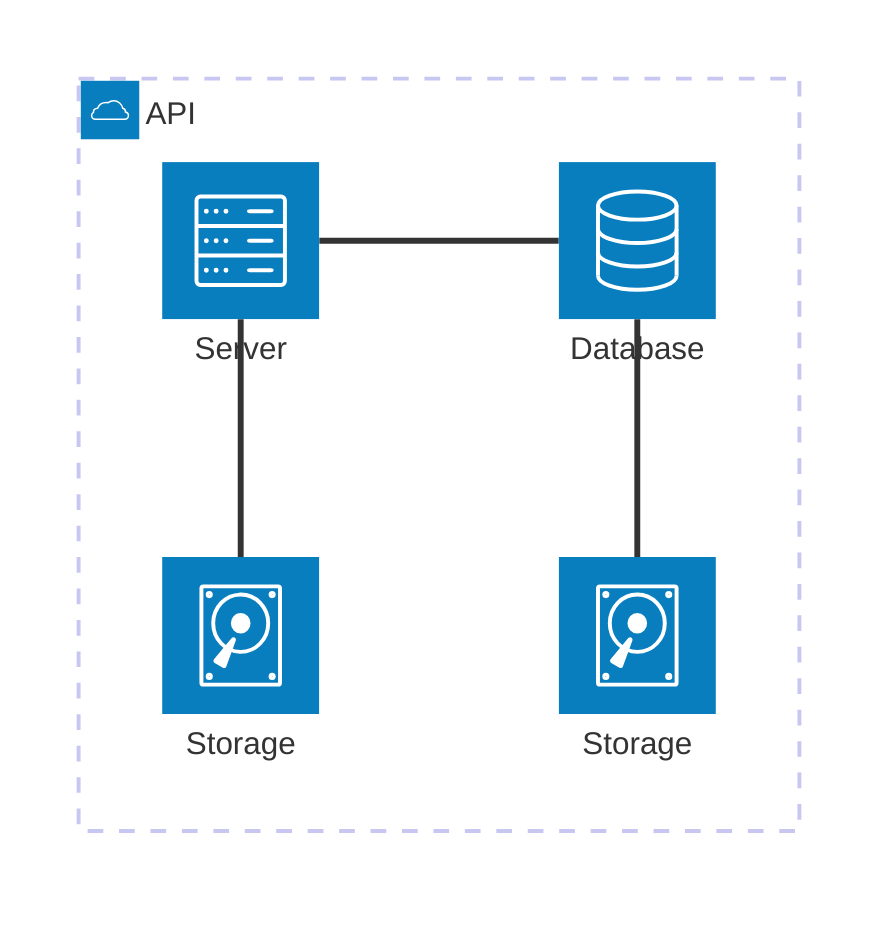
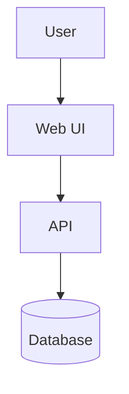

test file

architecture1.mermaid
block1.mermaid
class1.mermaid
er1.mermaid
flowchart1.mermaid
ghantt1.mermaid
gitgraph1.mermaid
journey1.mermaid
kanban1.mermaid
mindmap1.mermaid
packet1.mermaid
pie1.mermaid
quadrant1.mermaid
requirement1.mermaid
sankey1.mermaid
sequence1.mermaid
state1.mermaid
timeline1.mermaid
xychart1.mermaid
zenuml1.mermaid

